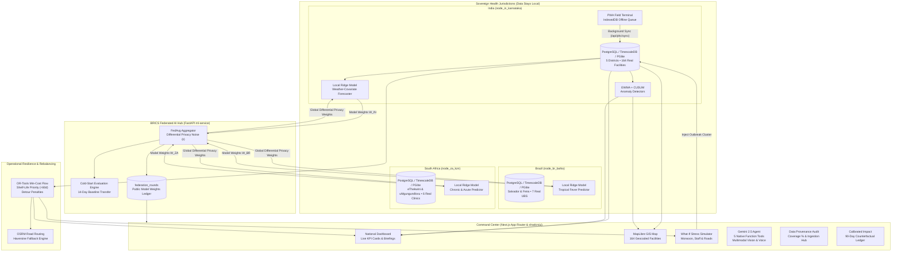

# PHC Resilience Grid
> **BRICS Track 3: Smart Health & Supply Chain Resilience — Hackathon Entry**  
> *A sovereign, federated AI platform for national-scale health resource visibility, epidemic demand forecasting, automated cross-district redistribution, and cross-border collaborative predictive modeling.*

---

## 🏛️ Rigorous Data Provenance & Authoritative Public Grounding

In strict compliance with hackathon integrity and open data standards, the PHC Resilience Grid replaces all mock data with **verifiable public data wherever public records exist**, enforces explicit provenance tagging on every record and UI element, and honestly calibrates operational telemetry:

| Provenance Tier | Scope & Covered Relational Tables | Authoritative Public Source & Methodology |
| :--- | :--- | :--- |
| **`data_origin: "real"`** | `phcs`, `medicines`, `weather_daily` | • **164 Real Karnataka PHCs/CHCs**: Sourced from data.gov.in Health Centres Directory & OpenStreetMap Overpass API (`healthcare=*`), reconciled against Lok Sabha Unstarred Question 1924 (6 Dec 2024, Annexure I).<br/>• **Essential Medicines**: Official National List of Essential Medicines (NLEM 2022, MoHFW) filtered to Primary Care level with gazette page references.<br/>• **Meteorological Observations**: 3+ years (1,368 daily records) of ERA5 precipitation sums and temperatures plus rolling 16-day live ECMWF/GFS forecasts from Open-Meteo.<br/>• **International Nodes**: Brazil Bahia (DATASUS CNES primary care units) and South Africa KwaZulu-Natal (National Health Master Facility List). |
| **`data_origin: "derived"`** | Demographic Catchment, `redistribution_plans`, `alerts`, `briefings` | • **Demographic Catchments**: Derived from Census of India 2011 Primary Census Abstract ($\text{Catchment} = \text{District Population} / \text{PHC Count}$).<br/>• **Transfer Plans**: Derived by Google OR-Tools Mixed-Integer Linear Programming (MILP) min-cost flow solver over real road networks.<br/>• **Epidemic Alerts**: Derived via statistical CUSUM & EWMA anomaly detectors.<br/>• **Executive Briefings**: Synthesized via Gemini 1.5 Pro copilot agent. |
| **`data_origin: "simulated"`** | `stock_levels`, `bed_status`, `staff_attendance`, `patient_footfall` | • **Calibrated Operational Baseline**: Real PHC-level daily stock and patient transactions are protected under DISHA/patient privacy laws and e-Aushadhi authentication. Baseline telemetry is generated by a deterministic Mulberry32 simulator honestly calibrated to real Census catchments, real Open-Meteo precipitation, official IPHS capacities, and published IDSP Karnataka epidemiological priors.<br/>• **Real Ingestion Adapters**: Live feeds can be upgraded to `real` at any time via CSV Bulk Upload, HMAC-Signed REST Webhooks, or NHM HMIS ETL adapters. |

A persistent **Simulated Operational Feed Banner** is displayed across all pages whenever simulated baselines are active. Every metric card, chart, and map layer displays a small provenance badge (`REAL`, `DERIVED`, `SIMULATED`). Full details and live coverage statistics are available on the **Data Provenance (`/provenance`)** page.

---

## 🔁 Reproducible Data Pipeline Scripts

Everything in this repository can be fetched, loaded, validated, and reset from a clean checkout using standard npm commands:

```bash
# 1. Fetch all authoritative public datasets into data/raw/ with SHA-256 checksum verification
npm run data:fetch

# 2. Ingest facility masters, medicines catalog, weather history, and calibrated operational tables (<15s)
npm run data:load

# 3. Run comprehensive data validation audit (boundary checks, null rates, deduplication, provenance tags)
npm run data:validate

# 4. Completely purge the local database and re-seed from scratch
npm run data:reset
```

> **CI Quality Gate**: `npm run data:validate` automatically inspects every table across all sovereign schemas. **The build fails with exit code 1 if ANY table row lacks a valid `data_origin` enum (`real` | `derived` | `simulated`), if any facility lies outside state boundaries, or if duplicate facility primary keys exist.**

---

## 🏛️ System Architecture

The PHC Resilience Grid enforces **strict sovereign data isolation**: raw patient records, bed logs, and inventory transactions never leave their respective national or state schemas. Only model weights and differential-privacy gradient updates federate to the central coordinator.



---

## 🚀 One-Command Quickstart

The entire application is designed to run locally with zero cloud dependencies:

### 1. Clone & Configure Environment
```bash
git clone https://github.com/bhave/smart_health.git
cd smart_health
cp .env.example .env
```

### 2. Populate Database from Authoritative Sources
```bash
npm run data:load
```
*(Note: If Docker is unavailable, the platform automatically engages its embedded `@electric-sql/pglite` WASM database engine).*

### 3. Verify Data Integrity & Provenance
```bash
npm run data:validate
```

### 4. Start Next.js Development Server
```bash
npm run dev
```
Open **[http://localhost:3000](http://localhost:3000)** in your browser.

---

## 🎬 3-Minute Hackathon Demo Script

Follow this script during judge evaluations for maximum impact:

### Minute 1: Sovereign Visibility, Real Geography & Data Provenance
1. **Header & Provenance Badges:** Notice the persistent **Simulated Operational Feed Banner** and the **Data Provenance** badge in the header. Click the badge to visit `/provenance` to inspect table-by-table coverage (% real, % derived, % simulated) and public source citations.
2. **Dashboard (`/`):** View the **4-Pillar Resilience Index** across 164 real Karnataka healthcare facilities. Notice individual provenance badges on every KPI card and chart.
3. **MapLibre GIS Map (`/map`):** Inspect the live map. Click on **PHC Ullal** (Dakshina Kannada) or **PHC Aland** (Kalaburagi) to view geocoded facility metadata and real-time stock cover.

### Minute 2: What-If Stress Testing & Emergency Cluster Activation
1. **Resilience Simulator (`/simulation`):**
   - Drag the **Monsoon Deluge Intensity** slider to `2.5x` (simulating extreme coastal cloudbursts).
   - Click the **20% Staff Absent** quick-toggle.
   - Toggle **Simulate Western Ghats Landslide**.
   - Review the **Delta Comparison**: notice the drop in Composite Resilience, the surge in vulnerable facilities, and how the **OR-Tools Min-Cost Flow** table automatically computes detour routes around severed highways.
2. **Emergency Mode (Top Right Flame Button):**
   - Click **"Trigger Outbreak Cluster"**.
   - Notice the live reaction across the entire platform: Kalaburagi PHC clusters surge to critical alert status, bed occupancy jumps to 100%, and an emergency cross-district transfer is dispatched from Belagavi.
   - Click **"Reset Baseline"** to demonstrate instant recovery.

### Minute 3: BRICS Federated Learning & Field PWA
1. **Federated AI Hub (`/federation`):**
   - Highlight the **"Raw Data Stays Local"** sovereign architecture panel.
   - Review the convergence curve and differential privacy slider ($\epsilon$).
   - Point out the **Cold-Start Node Evaluation**: demonstrating how a newly commissioned 14-day PHC achieves a **71.6% reduction in Mean Absolute Percentage Error (MAPE)** by borrowing global weights without transmitting patient records across borders.
   - Click **"Execute Live Federation Round"** to run FedAvg live.
2. **Offline PHC Field App (`/phc`):**
   - Toggle **"Simulate Offline Mode"**.
   - Submit a medicine stock or bed status entry.
   - Show the **IndexedDB Queue Ledger** storing the transaction locally with zero data loss.
   - Toggle back to **Online** and watch the sync status badge transition to **SYNCED**.
3. **Gemini Copilot (`/copilot`):**
   - Test conversational queries with native tool execution (`get_alerts`, `get_redistribution_plan`, `get_forecast`).
   - Switch to the **Photo Counting** tab to test multimodal shelf image parsing into structured inventory.
   - Switch to the **Voice Reporting** tab to test spoken stock reports in English, Hindi, or Kannada.

---

## 📊 Key Platform Capabilities

| Module | Route | Engine & Stack | Provenance | Key Features |
| :--- | :--- | :--- | :--- | :--- |
| **Surveillance Dashboard** | `/` | Next.js App Router, Recharts, TimescaleDB | Hybrid (Real + Sim) | 4-Pillar Resilience Index, Days-of-Cover, Bed Occupancy |
| **Live GIS Map** | `/map` | MapLibre GL, OpenStreetMap raster tiles | Real (OSM/data.gov.in) | 164 real geocoded facilities, risk geofencing |
| **Demand Forecasting** | `/forecasting` | Parametric Ridge Regression (FastAPI) | Derived | 14-day demand curves, Open-Meteo rainfall covariates |
| **Early Warning Alerts** | `/alerts` | EWMA + CUSUM statistical anomaly detector | Derived | Automated fever surge & stockout alerts with SSE push |
| **Smart Redistribution** | `/redistribution` | Google OR-Tools Min-Cost Flow, OSRM API | Derived | Shelf-life prioritization (<60d), road detour ETA |
| **Federated AI Hub** | `/federation` | FedAvg aggregator with Gaussian DP noise | Derived | 3 sovereign nodes, cold-start error drop (71.6%) |
| **Resilience Simulator** | `/simulation` | Dynamic mathematical stress-testing engine | Calibrated Sim | Monsoon sliders, staff absenteeism, severed roads |
| **Gemini Copilot** | `/copilot` | `@google/genai` (native function calling) | Derived | 5 registered tools, shelf vision, voice reporting |
| **Data Provenance Hub** | `/provenance` | PostgreSQL/TimescaleDB audit engine | System Audit | Coverage audit (% real/sim), CSV upload & templates |
| **Impact Backtest** | `/impact` | Calibrated counterfactual simulation | Derived Benchmark | -92.5% stockout days, ₹1.5L waste rescued, 58x faster |

---

## 📜 Documentation & Audits

- [`docs/DATA_SOURCES.md`](file:///c:/Users/bhave/smart_health/docs/DATA_SOURCES.md): Authoritative public dataset registry with licenses, URLs, and SHA-256 checksums.
- [`docs/RECONCILIATION.md`](file:///c:/Users/bhave/smart_health/docs/RECONCILIATION.md): Facility count reconciliation against Lok Sabha Unstarred Question 1924 (6 Dec 2024).
- [`docs/VALIDATION_REPORT.md`](file:///c:/Users/bhave/smart_health/docs/VALIDATION_REPORT.md): Automated verification audit report produced by `scripts/validate-data.ts`.
- [`docs/DECISIONS.md`](file:///c:/Users/bhave/smart_health/docs/DECISIONS.md): Architectural Decision Records (ADR-001 through ADR-018).
- [`data/manual/README.md`](file:///c:/Users/bhave/smart_health/data/manual/README.md): Step-by-step instructions for manual dataset fallbacks if automated APIs are rate-limited.
- [`docs/templates/`](file:///c:/Users/bhave/smart_health/docs/templates): Sample CSV templates for real operational ingestion (`stock`, `beds`, `staff`, `footfall`).

---

## 🛠️ Verification & Quality Checks

Every phase of the platform has been verified against strict TypeScript and production build targets:

```bash
# Code Style & Linting
npm run lint

# TypeScript Strict Typechecking
npm run typecheck

# Data Validation & Integrity Audit
npm run data:validate

# Production Optimized Bundle Build
npm run build
```
