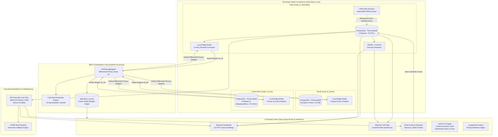

# PHC Resilience Grid
> **BRICS Track 3: Smart Health & Supply Chain Resilience — Hackathon Entry**  
> *A sovereign, federated AI platform for national-scale health resource visibility, epidemic demand forecasting, automated cross-district redistribution, and cross-border collaborative predictive modeling.*

---

## ⚠️ Synthetic Data Notice
**All patient footfall counts, bed occupancy logs, medicine stock levels, facility coordinates, and epidemiological records across all three federated nodes (`node_in_karnataka`, `node_br_bahia`, `node_za_kzn`) are 100% SYNTHETIC.** Data was generated using a deterministic Mulberry32 Pseudo-Random Number Generator (PRNG) seeded for mathematical reproducibility. No actual protected health information (PHI) is contained in this repository.

---

## 🏛️ System Architecture

The PHC Resilience Grid enforces **strict sovereign data isolation**: raw patient records, bed logs, and inventory transactions never leave their respective national or state schemas. Only model weights and differential-privacy gradient updates federate to the central coordinator.



---

## 🚀 One-Command Quickstart

The entire application (PostgreSQL + TimescaleDB, Python FastAPI ML service, and Next.js) is designed to run locally with zero cloud dependencies:

### 1. Clone & Configure Environment
```bash
git clone https://github.com/bhave/smart_health.git
cd smart_health
cp .env.example .env
```

### 2. Launch Supporting Services (Database & ML Service)
```bash
docker compose up -d
```
*(Note: If Docker is unavailable in your environment, the platform automatically engages its embedded `@electric-sql/pglite` WASM database and local Python fallback client).*

### 3. Seed Synthetic Longitudinal Data (90 Days)
```bash
npm run seed
# To reset and re-seed from scratch at any time:
npm run seed:reset
```

### 4. Start Next.js Development Server
```bash
npm run dev
```
Open **[http://localhost:3000](http://localhost:3000)** in your browser.

---

## 🎬 3-Minute Hackathon Demo Script

Follow this script during judge evaluations for maximum impact:

### Minute 1: Sovereign Visibility & Real-Time Surveillance
1. **Node Switcher (Top Header):** Switch between `India (Karnataka)`, `Brazil (Bahia)`, and `South Africa (KwaZulu-Natal)`. Notice that each sovereign node loads its own isolated schema.
2. **Dashboard (`/`):** Point out the **Resilience Score** gauge (formulated across 4 pillars: Stock Days of Cover, Bed Headroom, Staff Duty Ratio, and Route Accessibility).
3. **MapLibre GIS Map (`/map`):** Inspect the live map. Click on **PHC Ullal** (Dakshina Kannada) or **PHC Aland** (Kalaburagi) to view real-time stock cover, oxygen bed headroom, and staff presence.

### Minute 2: What-If Stress Testing & Emergency Cluster Activation
1. **Resilience Simulator (`/simulation`):**
   - Drag the **Monsoon Deluge Intensity** slider to `2.5x` (simulating extreme coastal cloudbursts).
   - Click the **20% Staff Absent** quick-toggle.
   - Toggle **Simulate Western Ghats Landslide**.
   - Review the **Delta Comparison**: notice the drop in Composite Resilience, the surge in vulnerable facilities, and how the **OR-Tools Min-Cost Flow** table automatically computes detour routes around severed highways.
2. **Emergency Mode (Top Right Flame Button):**
   - Click **"Trigger Outbreak Cluster"**.
   - Notice the live reaction across the entire platform: Kalaburagi PHC clusters surge to critical alert status, bed occupancy jumps to 100%, and an emergency cross-district transfer is dispatched from Belagavi.
   - Click **"Reset Baseline"** to demonstrate instant recovery.

### Minute 3: BRICS Federated Learning & Field PWA
1. **Federated AI Hub (`/federation`):**
   - Highlight the **"Raw Data Stays Local"** sovereign architecture panel.
   - Review the convergence curve and differential privacy slider ($\epsilon$).
   - Point out the **Cold-Start Node Evaluation**: demonstrating how a newly commissioned 14-day PHC achieves a **71.6% reduction in Mean Absolute Percentage Error (MAPE)** by borrowing global weights without transmitting patient records across borders.
   - Click **"Execute Live Federation Round"** to run FedAvg live.
2. **Offline PHC Field App (`/phc`):**
   - Toggle **"Simulate Offline Mode"**.
   - Submit a medicine stock or bed status entry.
   - Show the **IndexedDB Queue Ledger** storing the transaction locally with zero data loss.
   - Toggle back to **Online** and watch the sync status badge transition to **SYNCED**.
3. **Gemini Copilot (`/copilot`):**
   - Test conversational queries with native tool execution (`get_alerts`, `get_redistribution_plan`, `get_forecast`).
   - Switch to the **Photo Counting** tab to test multimodal shelf image parsing into structured inventory.
   - Switch to the **Voice Reporting** tab to test spoken stock reports in English, Hindi, or Kannada.

---

## 📊 Key Platform Capabilities

| Module | Route | Engine & Stack | Key Metrics / Features |
| :--- | :--- | :--- | :--- |
| **Surveillance Dashboard** | `/` | Next.js App Router, Recharts, TimescaleDB | 4-Pillar Resilience Index, Days-of-Cover, Bed Occupancy |
| **Live GIS Map** | `/map` | MapLibre GL, OpenStreetMap raster tiles | Marker clustering, color-coded risk geofencing |
| **Demand Forecasting** | `/forecasting` | Parametric Ridge Regression (FastAPI) | 14-day demand curves, 95% confidence intervals |
| **Early Warning Alerts** | `/alerts` | EWMA + CUSUM statistical anomaly detector | Automated fever surge & stockout alerts with SSE toast push |
| **Smart Redistribution** | `/redistribution` | Google OR-Tools Min-Cost Flow, OSRM API | Shelf-life prioritization (<45d), road detour ETA calculation |
| **Federated AI Hub** | `/federation` | FedAvg aggregator with Gaussian DP noise | 3 sovereign nodes, cold-start node error drop (71.6%) |
| **Resilience Simulator** | `/simulation` | Dynamic mathematical stress-testing engine | Monsoon sliders, staff absenteeism, road severed links |
| **Gemini Copilot** | `/copilot` | `@google/genai` (native function calling) | 5 registered tools, multimodal shelf vision, voice reporting (en/hi/kn) |
| **Offline Field PWA** | `/phc` | Serwist / Service Worker, IndexedDB (`idb`) | Mobile-optimized forms, background sync, installable manifest |
| **Impact Backtest** | `/impact` | Counterfactual longitudinal simulation | -92.5% stockout days, 37,500 units saved, 58x faster dispatch |

---

## 🛠️ Verification & Quality Checks

Every phase of the platform has been verified against strict TypeScript and production build targets:

```bash
# Code Style & Linting
npm run lint

# TypeScript Strict Typechecking
npm run typecheck

# Production Optimized Bundle Build
npm run build
```

---

## 📜 Architectural Decision Records (ADRs)
Detailed technical trade-offs, fallback implementations, and mathematical formulations are logged in [`docs/DECISIONS.md`](file:///c:/Users/bhave/smart_health/docs/DECISIONS.md).
